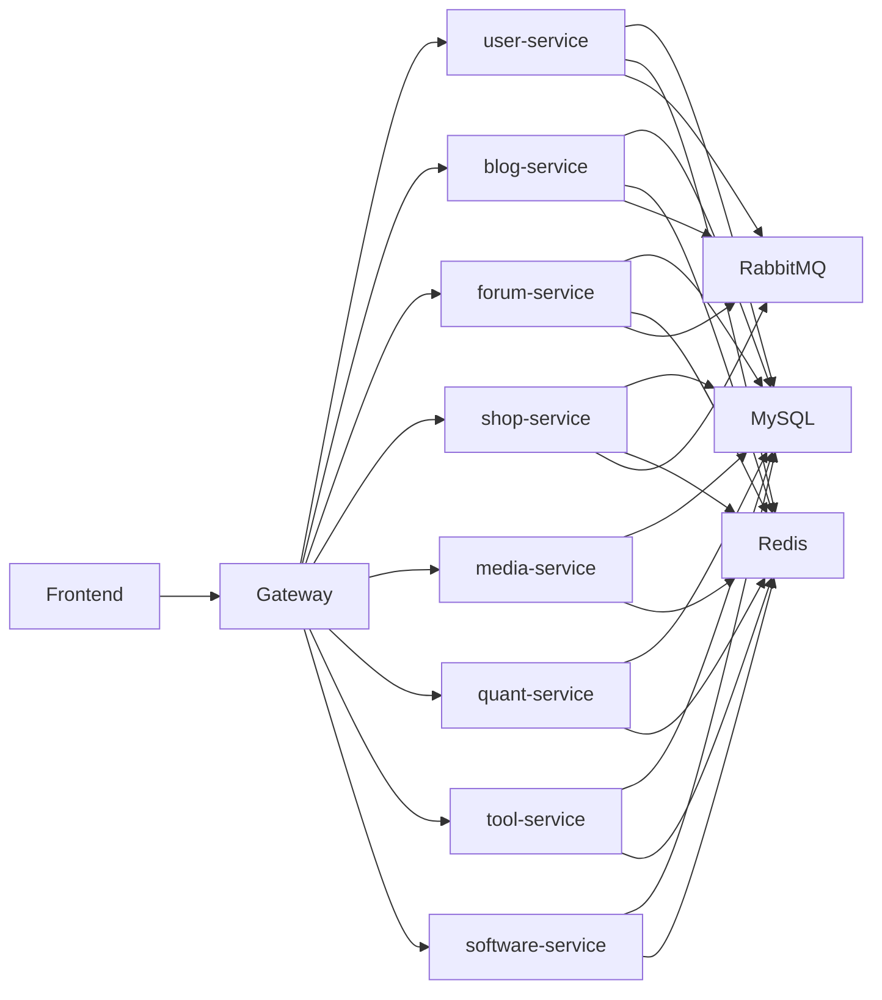

# Modules

## Module Map

```mermaid
flowchart LR
  A[Frontend] --> B[Gateway]
  B --> C[user-service]
  B --> D[blog-service]
  B --> E[forum-service]
  B --> F[shop-service]
  B --> G[media-service]
  B --> H[quant-service]
  B --> I[tool-service]
  B --> J[software-service]
  C --> K[MySQL]
  D --> K
  E --> K
  F --> K
  G --> K
  H --> K
  I --> K
  J --> K
  C --> L[Redis]
  D --> L
  E --> L
  F --> L
  G --> L
  H --> L
  I --> L
  J --> L
  C --> M[RabbitMQ]
  D --> M
  E --> M
  F --> M
```

## Add New Module

1. 新建后端服务，继承 `backend/pom.xml`
2. 复制分层结构：Controller -> Service -> Mapper -> Entity -> DTO/VO
3. 在 Gateway 新增路由
4. 前端新增页面、API、Store
5. 新增数据库与 Nacos 配置
